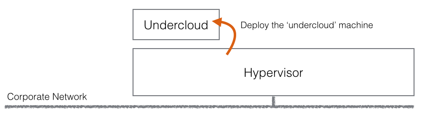

= Workshop de Red Hat Openstack v11.
Miguel Pineda <mpinedam@redhat.com>

== Laboratorio 0.

=== Introducción.

El objetivo principal de esté workshop es que los asistentes conozcan Red Hat OSP Director, facilitar su uso y ayudar a comprender sus conceptos. Aunque mucho de esto podría cubrirse con videos y diapositivas, la mejor forma de aprender es practicando y hágaciendolo usted mismo.

Red Hat está invirtiendo fuertemente en la habilitación, cada persona tendrá acceso a un sistema de 32 CPU con 96 GB de memoria. Entonces, si bien tendrá que hacer los laboratorios con máquinas virtuales encima del host, nuestra intención es hacer que los laboratorios prácticos estén lo más cerca posible de la implementación del mundo real/cliente. En este taller podremos emular con éxito una gran parte de la administración "bare-metal".

Lo único que necesitará en su computadora portátil es su cliente SSH, y tal vez un navegador web. El resto de este capítulo aclarará el entorno que utilizará y se asegurará de que tenga conectividad. Se le asignarán detalles de conexión y credenciales.

=== 1 .- Arquitectura de Laboratorio. 

Como se menciono en la introducción, a cada asistente se le ha asignado una máquina con 32 CPU, 96 GB de memoria y una conexión de 1 Gb de red corporativa (con un salto corto a todos los repositorios de paquetes que necesitaremos). Este será su Host durante la semana, nadie más tendrá acceso a él, y si tenemos que reconstruirlo podemos hacerlo por usted. Esta será nuestra plataforma para implementar nuestra infraestructura en la parte superior de:

Para simplificar la arquitectura, este host se usará para desplegar varias máquinas virtuales que conformarán tanto su undercloud como overcloud, siendo el host la plataforma de IPMI que usará Ironic para arrancar las máquinas virtuales. Podríamos usar fácilmente el hipervisor como undercloud, pero por limpieza desplegaremos la undercloud dentro de una máquina virtual:

se agrega el domigo 4 de febrero.
